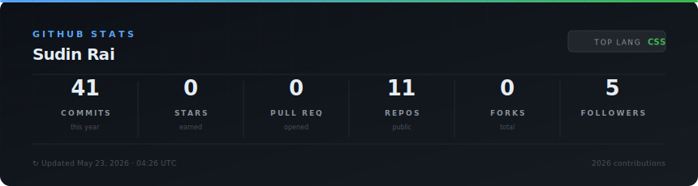

<h1 align="center">Hi, I'm Sudin Rai👋</h1>

  Full Stack Developer · BCA Student @ Kathmandu College of Technology

  
  
  

---

### About Me

- 🎓 Studying **BCA** at Kathmandu College of Technology (Tribhuvan University)
- 🔨 Building full-stack web apps with the **MERN stack**
- 🤖 Interested in **AI systems**, competitive programming, and clean architecture
- 🎯 Actively looking for **Full Stack Developer internship** opportunities
- 📍 Based in **Kathmandu, Nepal**

---

### Tech Stack

**Languages**

**Frontend**

**Backend**

**Databases**

**DevOps & Infrastructure**

**Backend Concepts**

---

### GitHub Stats

  

<!-- 

  
  

 -->

---

  Open to internship opportunities — let's connect.

